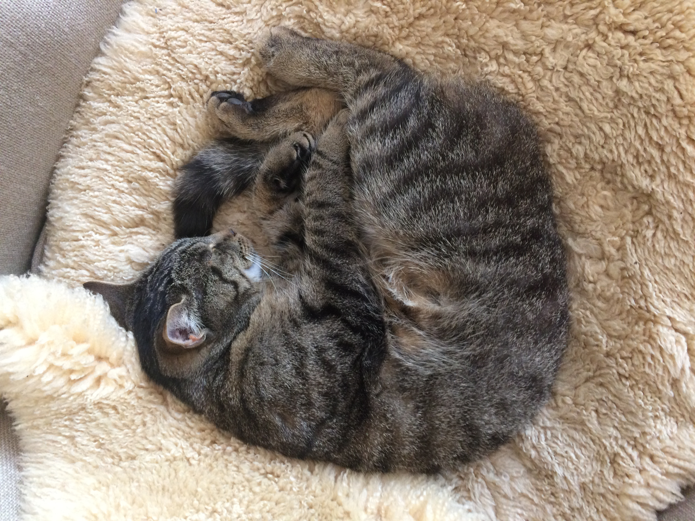

# About Me

My name is Josef Zoller, and I'm a software developer from Germany (although I was originally born in Switzerland, shortly before my parents moved there and I moved back here in 2021).
Currently, I'm studying Computer Science at *ETH Zürich*.

I had been interested in programming and computer science for several years before I started studying.
In my free time, I mostly do random projects (and never really finish them) whenever there is something new I want to try out.

Especially, I'm interested in systems-level programming, like embedded systems (think ESP32 and the likes), compilers and programming languages, and distributed and decentralized networking.
But I also enjoy working as a full-stack web developer and have experience with various web technologies.

My programming language of choice is still Swift, as I started learning it when I first got into programming and because it's just a really nice and beautiful language to work with.
However, in the recent months, I've been working a lot with Rust and have come to really appreciate it as well.
Other languages I've worked with include Python, JavaScript, TypeScript, C, C++, C#, Java, and a few more obscure ones like Haskell.

I'm a big fan of open-source software and try to contribute to projects whenever I can.
Most of my own projects are also open-source and can be found on my [GitHub profile](https://github.com/Zollerboy1).

When I'm not programming, I enjoy playing video games, watching TV shows and movies, biking or hiking in and around Zürich, cooking a nice meal, or just hanging out with friends.
Also, I really like singing in a choir and trying (and mostly failing) to play other instruments like the piano.

My cat, *Buuts* (pronounced like "boots" -- just don't question the name), is the cutest cat in the world and I love her to bits.
Unfortunately, she's still living with my parents in Germany, so I don't get to see her very often.
Here's another picture of her sleeping:

